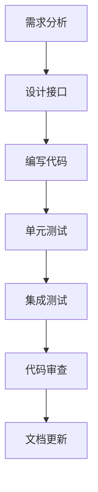

# STM32开发：从Keil到VSCode+命令行完整迁移指南

## 📋 目录

1. [迁移概述](#迁移概述)
2. [开发环境对比](#开发环境对比)
3. [PlatformIO迁移方案](#platformio迁移方案)
4. [CMake从零构建方案](#cmake从零构建方案)
5. [项目迁移步骤](#项目迁移步骤)
6. [常用命令速查](#常用命令速查)
7. [故障排除](#故障排除)
8. [最佳实践](#最佳实践)

---

## 迁移概述

### 🎯 为什么要迁移？

从Keil MDK迁移到VSCode+命令行开发有以下优势：

| 方面 | Keil MDK | VSCode+命令行 |
|------|----------|---------------|
| **成本** | 商业软件，价格昂贵 | 完全免费 |
| **跨平台** | 仅Windows | Windows/Linux/macOS |
| **可定制性** | 界面固定 | 高度可定制 |
| **版本控制** | 项目文件复杂 | 文本配置，Git友好 |
| **自动化** | 有限 | 完全可编程 |
| **生态系统** | 封闭 | 开放，插件丰富 |

### 🔄 迁移策略

本指南提供两种迁移方案：

1. **PlatformIO方案** - 适合快速迁移现有项目
2. **CMake方案** - 适合从零开始构建，完全可控

---

## 开发环境对比

### Keil MDK开发流程


### VSCode+命令行开发流程


---

## PlatformIO迁移方案

### 🚀 快速开始

#### 1. 安装PlatformIO

```bash
# 方法1：通过pip安装
pip install platformio

# 方法2：安装VSCode扩展
# 在VSCode中搜索并安装 "PlatformIO IDE"
```

#### 2. 创建新项目

```bash
# 创建STM32F103项目
pio project init --board genericSTM32F103VE --project-option "framework=stm32cube"

# 或使用交互式创建
pio project init
```

#### 3. 项目结构

```
platformio_project/
├── platformio.ini          # 项目配置文件
├── src/                    # 源代码目录
├── include/               # 头文件目录
├── lib/                   # 本地库目录
├── test/                  # 测试代码
└── .pio/                  # PlatformIO缓存
```

#### 4. 配置文件示例

```ini
; platformio.ini
[env:stm32f103ve]
platform = ststm32
board = genericSTM32F103VE
framework = stm32cube

; 编译选项
build_flags = 
    -D STM32F103xE
    -D USE_HAL_DRIVER
    -D HSE_VALUE=8000000
    -Os
    -Wall

; 串口配置
monitor_speed = 115200
monitor_port = COM3

; 上传配置
upload_protocol = stlink
debug_tool = stlink
```

### 📝 从Keil迁移代码

#### 库函数转换

**Keil标准外设库 → HAL库**

```c
// Keil版本 (标准外设库)
RCC_APB1PeriphClockCmd(RCC_APB1Periph_TIM2, ENABLE);
TIM_TimeBaseInit(TIM2, &TIM_TimeBaseStructure);
TIM_SetCompare1(TIM2, ccr_value);

// PlatformIO版本 (HAL库)
__HAL_RCC_TIM2_CLK_ENABLE();
HAL_TIM_Base_Init(&htim2);
__HAL_TIM_SET_COMPARE(&htim2, TIM_CHANNEL_1, ccr_value);
```

#### 初始化方式转换

**Keil手动配置 → HAL结构体配置**

```c
// Keil版本
GPIO_InitTypeDef GPIO_InitStructure;
GPIO_InitStructure.GPIO_Pin = GPIO_Pin_0;
GPIO_InitStructure.GPIO_Mode = GPIO_Mode_AF_PP;
GPIO_InitStructure.GPIO_Speed = GPIO_Speed_50MHz;
GPIO_Init(GPIOA, &GPIO_InitStructure);

// PlatformIO版本 (类似，但使用HAL)
GPIO_InitTypeDef GPIO_InitStruct = {0};
GPIO_InitStruct.Pin = GPIO_PIN_0;
GPIO_InitStruct.Mode = GPIO_MODE_AF_PP;
GPIO_InitStruct.Speed = GPIO_SPEED_FREQ_LOW;
HAL_GPIO_Init(GPIOA, &GPIO_InitStruct);
```

### 🛠️ 常用PlatformIO命令

```bash
# 构建项目
pio run

# 烧录程序
pio run --target upload

# 清理构建
pio run --target clean

# 串口监视器
pio device monitor

# 单元测试
pio test

# 检查代码
pio check

# 更新平台
pio platform update

# 库管理
pio lib search "library_name"
pio lib install "library_name"
```

---

## CMake从零构建方案

### 🏗️ 项目搭建

#### 1. 目录结构

```
cmake_project/
├── CMakeLists.txt              # 主构建文件
├── cmake/
│   └── arm-none-eabi-gcc.cmake # 工具链文件
├── include/                    # 头文件
├── src/                        # 源文件
├── drivers/                    # HAL库文件
├── scripts/                    # 构建脚本
└── STM32F103VETx_FLASH.ld     # 链接脚本
```

#### 2. 主CMakeLists.txt

```cmake
cmake_minimum_required(VERSION 3.22)

# 设置工具链
set(CMAKE_TOOLCHAIN_FILE ${CMAKE_CURRENT_SOURCE_DIR}/cmake/arm-none-eabi-gcc.cmake)

# 项目定义
project(stm32_project LANGUAGES C ASM)

# 芯片配置
set(MCU_FAMILY STM32F1xx)
set(MCU_MODEL STM32F103xE)
set(CPU_PARAMETERS 
    -mcpu=cortex-m3
    -mthumb
    -mfloat-abi=soft
)

# 编译选项
set(CMAKE_C_FLAGS "${CMAKE_C_FLAGS} ${CPU_PARAMETERS}")
set(CMAKE_C_FLAGS "${CMAKE_C_FLAGS} -Wall -Wextra -Os -g3")

# 链接选项
set(CMAKE_EXE_LINKER_FLAGS "${CMAKE_EXE_LINKER_FLAGS} ${CPU_PARAMETERS}")
set(CMAKE_EXE_LINKER_FLAGS "${CMAKE_EXE_LINKER_FLAGS} -Wl,--gc-sections")

# 定义宏
add_definitions(-D${MCU_MODEL} -DUSE_HAL_DRIVER -DHSE_VALUE=8000000)

# 包含路径
include_directories(
    include
    drivers/CMSIS/Include
    drivers/CMSIS/Device/ST/STM32F1xx/Include
    drivers/STM32F1xx_HAL_Driver/Inc
)

# 源文件
file(GLOB_RECURSE SOURCES "src/*.c" "drivers/STM32F1xx_HAL_Driver/Src/*.c")
list(APPEND SOURCES "drivers/CMSIS/Device/ST/STM32F1xx/Source/Templates/gcc/startup_stm32f103xe.s")
list(APPEND SOURCES "drivers/CMSIS/Device/ST/STM32F1xx/Source/Templates/system_stm32f1xx.c")

# 创建可执行文件
add_executable(${PROJECT_NAME}.elf ${SOURCES})

# 链接脚本
set(LINKER_SCRIPT ${CMAKE_CURRENT_SOURCE_DIR}/STM32F103VETx_FLASH.ld)
target_link_options(${PROJECT_NAME}.elf PRIVATE -T${LINKER_SCRIPT})

# 生成hex和bin文件
add_custom_command(TARGET ${PROJECT_NAME}.elf POST_BUILD
    COMMAND ${CMAKE_OBJCOPY} -O ihex $<TARGET_FILE:${PROJECT_NAME}.elf> ${PROJECT_NAME}.hex
    COMMAND ${CMAKE_OBJCOPY} -O binary $<TARGET_FILE:${PROJECT_NAME}.elf> ${PROJECT_NAME}.bin
)

# 烧录目标
add_custom_target(flash
    COMMAND openocd -f interface/stlink.cfg -f target/stm32f1x.cfg -c "program ${PROJECT_NAME}.hex verify reset exit"
    DEPENDS ${PROJECT_NAME}.elf
)
```

#### 3. 工具链文件

```cmake
# cmake/arm-none-eabi-gcc.cmake
set(CMAKE_SYSTEM_NAME Generic)
set(CMAKE_SYSTEM_PROCESSOR arm)

# 工具链前缀
set(TOOLCHAIN_PREFIX arm-none-eabi-)

# 编译器设置
set(CMAKE_C_COMPILER ${TOOLCHAIN_PREFIX}gcc)
set(CMAKE_ASM_COMPILER ${TOOLCHAIN_PREFIX}gcc)
set(CMAKE_OBJCOPY ${TOOLCHAIN_PREFIX}objcopy)
set(CMAKE_SIZE ${TOOLCHAIN_PREFIX}size)

# 编译器测试
set(CMAKE_C_COMPILER_WORKS TRUE)
set(CMAKE_ASM_COMPILER_WORKS TRUE)
```

### 🔧 构建脚本

#### build.sh

```bash
#!/bin/bash
set -e

PROJECT_NAME="stm32_project"
BUILD_DIR="build"

echo "构建STM32项目..."

# 创建构建目录
mkdir -p $BUILD_DIR
cd $BUILD_DIR

# 配置项目
cmake .. -DCMAKE_BUILD_TYPE=Release

# 构建项目
make -j$(nproc)

# 显示大小信息
arm-none-eabi-size ${PROJECT_NAME}.elf

echo "构建完成！"
```

#### flash.sh

```bash
#!/bin/bash
set -e

PROJECT_NAME="stm32_project"
BUILD_DIR="build"
HEX_FILE="${BUILD_DIR}/${PROJECT_NAME}.hex"

if [ ! -f "$HEX_FILE" ]; then
    echo "错误: hex文件不存在，请先构建项目"
    exit 1
fi

echo "烧录程序..."
openocd -f interface/stlink.cfg -f target/stm32f1x.cfg -c "program $HEX_FILE verify reset exit"
echo "烧录完成！"
```

---

## 项目迁移步骤

### 📋 迁移检查清单

#### 步骤1：环境准备

- [ ] 安装ARM工具链
- [ ] 安装VSCode和相关扩展
- [ ] 安装PlatformIO或CMake
- [ ] 安装OpenOCD
- [ ] 配置调试器

#### 步骤2：项目分析

- [ ] 识别使用的STM32芯片型号
- [ ] 列出使用的外设模块
- [ ] 分析时钟配置
- [ ] 检查中断配置
- [ ] 记录引脚配置

#### 步骤3：代码迁移

- [ ] 转换库函数调用
- [ ] 更新头文件包含
- [ ] 修改初始化代码
- [ ] 适配中断处理函数
- [ ] 更新配置文件

#### 步骤4：测试验证

- [ ] 编译通过
- [ ] 烧录成功
- [ ] 功能验证
- [ ] 性能测试
- [ ] 调试功能测试

### 🔄 具体迁移示例

#### 从Keil项目迁移到PlatformIO

1. **创建PlatformIO项目**
```bash
mkdir my_stm32_project
cd my_stm32_project
pio project init --board genericSTM32F103VE --project-option "framework=stm32cube"
```

2. **复制源文件**
```bash
# 复制用户源文件
cp /path/to/keil/project/USER/*.c src/
cp /path/to/keil/project/USER/*.h include/
```

3. **配置platformio.ini**
```ini
[env:stm32f103ve]
platform = ststm32
board = genericSTM32F103VE
framework = stm32cube

build_flags = 
    -D STM32F103xE
    -D USE_HAL_DRIVER
    -D HSE_VALUE=8000000

monitor_speed = 115200
upload_protocol = stlink
debug_tool = stlink
```

4. **转换代码**
```c
// 替换标准外设库函数为HAL库函数
// 更新头文件包含
// 修改初始化代码
```

5. **构建和测试**
```bash
pio run
pio run --target upload
```

---

## 常用命令速查

### PlatformIO命令

| 功能 | 命令 | 说明 |
|------|------|------|
| 构建 | `pio run` | 编译项目 |
| 烧录 | `pio run -t upload` | 烧录到目标板 |
| 清理 | `pio run -t clean` | 清理构建文件 |
| 监视器 | `pio device monitor` | 串口监视器 |
| 调试 | `pio debug` | 启动调试会话 |
| 测试 | `pio test` | 运行单元测试 |
| 检查 | `pio check` | 静态代码分析 |

### CMake命令

| 功能 | 命令 | 说明 |
|------|------|------|
| 配置 | `cmake ..` | 配置构建系统 |
| 构建 | `make -j$(nproc)` | 并行编译 |
| 清理 | `make clean` | 清理构建文件 |
| 烧录 | `make flash` | 烧录程序 |
| 调试 | `make debug` | 启动调试服务器 |

### OpenOCD命令

| 功能 | 命令 | 说明 |
|------|------|------|
| 烧录 | `openocd -f interface/stlink.cfg -f target/stm32f1x.cfg -c "program file.hex verify reset exit"` | 烧录hex文件 |
| 调试 | `openocd -f interface/stlink.cfg -f target/stm32f1x.cfg` | 启动调试服务器 |
| 擦除 | `openocd -f interface/stlink.cfg -f target/stm32f1x.cfg -c "init; halt; stm32f1x mass_erase 0; exit"` | 擦除芯片 |

---

## 故障排除

### 🔧 常见问题

#### 1. 工具链问题

**问题**: `arm-none-eabi-gcc: command not found`

**解决方案**:
```bash
# Ubuntu/Debian
sudo apt install gcc-arm-none-eabi

# 或手动安装
wget https://developer.arm.com/-/media/Files/downloads/gnu-rm/10.3-2021.10/gcc-arm-none-eabi-10.3-2021.10-x86_64-linux.tar.bz2
tar -xjf gcc-arm-none-eabi-10.3-2021.10-x86_64-linux.tar.bz2
export PATH=$PATH:$PWD/gcc-arm-none-eabi-10.3-2021.10/bin
```

#### 2. 烧录问题

**问题**: `Error: unable to find CMSIS-DAP device`

**解决方案**:
```bash
# 检查设备连接
lsusb | grep STMicro

# 添加用户到dialout组
sudo usermod -a -G dialout $USER

# 重新登录或重启
```

#### 3. 编译问题

**问题**: `fatal error: stm32f1xx_hal.h: No such file or directory`

**解决方案**:
```bash
# 确保HAL库路径正确
# PlatformIO会自动下载
# CMake需要手动下载HAL库到drivers目录
```

#### 4. 调试问题

**问题**: `target remote localhost:3333` 连接失败

**解决方案**:
```bash
# 检查OpenOCD是否运行
ps aux | grep openocd

# 重启OpenOCD
sudo pkill openocd
openocd -f interface/stlink.cfg -f target/stm32f1x.cfg
```

### 📋 调试技巧

#### VSCode调试配置

```json
// .vscode/launch.json
{
    "version": "0.2.0",
    "configurations": [
        {
            "name": "Debug STM32",
            "type": "cortex-debug",
            "request": "launch",
            "servertype": "openocd",
            "cwd": "${workspaceRoot}",
            "executable": "build/project.elf",
            "configFiles": [
                "interface/stlink.cfg",
                "target/stm32f1x.cfg"
            ],
            "svdFile": "STM32F103.svd",
            "runToMain": true
        }
    ]
}
```

---

## 最佳实践

### 📚 项目组织

#### 1. 目录结构

```
project/
├── .vscode/           # VSCode配置
├── cmake/             # CMake模块
├── docs/              # 文档
├── include/           # 头文件
├── src/               # 源文件
├── tests/             # 测试代码
├── tools/             # 工具脚本
└── README.md          # 项目说明
```

#### 2. 版本控制

```bash
# .gitignore
build/
.pio/
*.hex
*.bin
*.map
.vscode/settings.json
```

#### 3. 代码风格

```c
// 使用一致的命名约定
void GPIO_Init(void);           // 函数名：大写开头
static bool is_initialized;    // 变量名：小写+下划线
#define MAX_BUFFER_SIZE 256     // 宏：全大写+下划线
```

### 🚀 开发流程

#### 1. 功能开发流程



#### 2. 自动化脚本

```bash
#!/bin/bash
# 完整的构建和测试脚本

echo "开始完整构建流程..."

# 1. 代码格式化
echo "格式化代码..."
find src include -name "*.c" -o -name "*.h" | xargs clang-format -i

# 2. 静态分析
echo "静态代码分析..."
cppcheck --enable=all --suppress=missingIncludeSystem src/

# 3. 构建项目
echo "构建项目..."
./scripts/build.sh

# 4. 运行测试
echo "运行测试..."
if [ -d "tests" ]; then
    pio test
fi

# 5. 生成文档
echo "生成文档..."
if command -v doxygen &> /dev/null; then
    doxygen Doxyfile
fi

echo "构建流程完成！"
```

### 📊 性能优化

#### 1. 编译优化

```cmake
# CMakeLists.txt
if(CMAKE_BUILD_TYPE STREQUAL "Release")
    set(CMAKE_C_FLAGS "${CMAKE_C_FLAGS} -Os -flto")
elseif(CMAKE_BUILD_TYPE STREQUAL "Debug")
    set(CMAKE_C_FLAGS "${CMAKE_C_FLAGS} -Og -g3")
endif()
```

#### 2. 链接优化

```cmake
# 移除未使用的代码
set(CMAKE_C_FLAGS "${CMAKE_C_FLAGS} -ffunction-sections -fdata-sections")
set(CMAKE_EXE_LINKER_FLAGS "${CMAKE_EXE_LINKER_FLAGS} -Wl,--gc-sections")
```

---

## 总结

### 🎯 迁移建议

1. **新手推荐**: 从PlatformIO开始，学习曲线平缓
2. **进阶用户**: 使用CMake，获得完全控制
3. **团队项目**: 统一开发环境，使用容器化开发
4. **持续集成**: 集成GitHub Actions或Jenkins

### 🚀 下一步学习

1. 深入学习CMake高级特性
2. 掌握OpenOCD调试技巧
3. 学习单元测试框架
4. 探索RTOS集成
5. 研究代码覆盖率工具

通过本指南，你应该能够成功地从Keil MDK迁移到现代化的VSCode+命令行开发环境，享受更加灵活、强大的开发体验！

---

**文档版本**: v2.0  
**更新日期**: 2024年  
**作者**: STM32开发团队